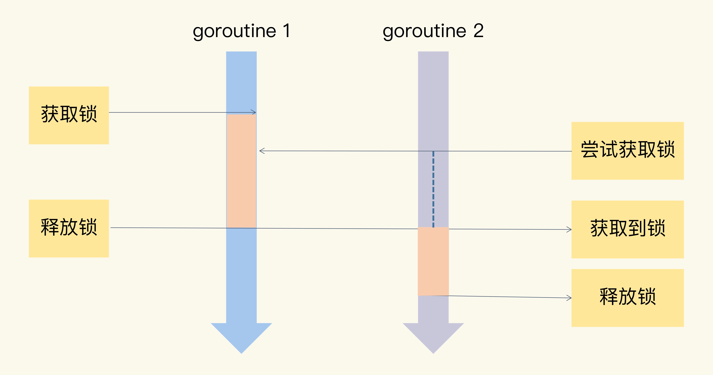

# Mutex and atomic
互斥锁就很好地解决了资源竞争问题，有人也把互斥锁叫做排它锁。
在 Go 标准库中，它提供了 Mutex 来实现互斥锁这个功能。

Mutex 是使用最广泛的同步原语（Synchronization primitives），有人也叫做并发原语。



在 Go 的标准库中，package sync 提供了锁相关的一系列同步原语，
这个 package 还定义了一个 Locker 的接口，Mutex 就实现了这个接口:
```
type Locker interface {
    Lock()
    Unlock()
}
```
当一个 goroutine 通过调用 Lock 方法获得了这个锁的拥有权后， 其它请求锁的 goroutine 就会阻塞在 Lock 方法的调用上，直到锁被释放并且自己获取到了这个锁的拥有权。

详见[Mutex Demo](./mutex_test.go) 

<br>

## 一个结论
1. 读写锁的性能随着并发量增大的情况，与 sync.RWMutex 一致；
2. 利用原子操作的无锁并发写的性能，随着并发量增大几乎保持恒定；
3. 利用原子操作的无锁并发读的性能，随着并发量增大有持续提升的趋势，并且性能是读锁的约 200 倍。

详见[Mutex和atomic对比](./atomic_test.go) 