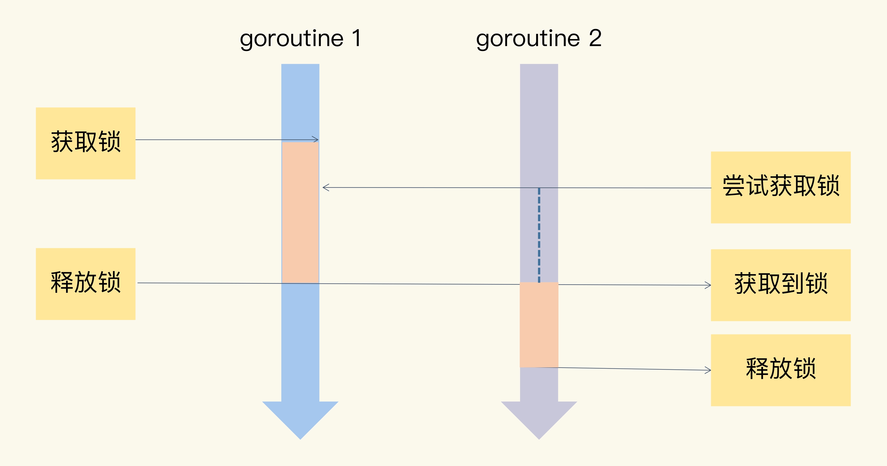

# Mutex and atomic
互斥锁就很好地解决了资源竞争问题，有人也把互斥锁叫做排它锁。
在 Go 标准库中，它提供了 Mutex 来实现互斥锁这个功能。

Mutex 是使用最广泛的同步原语（Synchronization primitives），有人也叫做并发原语。



在 Go 的标准库中，package sync 提供了锁相关的一系列同步原语，
这个 package 还定义了一个 Locker 的接口，Mutex 就实现了这个接口:
```
type Locker interface {
    Lock()
    Unlock()
}
```
当一个 goroutine 通过调用 Lock 方法获得了这个锁的拥有权后， 其它请求锁的 goroutine 就会阻塞在 Lock 方法的调用上，直到锁被释放并且自己获取到了这个锁的拥有权。

详见[Mutex Demo](./mutex_test.go) 

## Mutex 常见的错误场景
Mutex 常见的错误场景有 4 类，分别是 
- Lock/Unlock 不是成对出现
- Copy 已使用的 Mutex
- 重入, Mutex 不是可重入的锁, 因为 Mutex 的实现中没有记录哪个 goroutine 拥有这把锁。理论上，任何 goroutine 都可以随意地 Unlock 这把锁，所以没办法计算重入条件。
- 死锁

### 什么是可重入锁？
如果拥有这把锁的线程再请求这把锁的话，不会阻塞，而是成功返回，就叫可重入锁（有时候也叫做递归锁）。
只要你拥有这把锁，你可以可着劲儿地调用，比如通过递归实现一些算法，调用者不会阻塞或者死锁。

### 死锁的条件
死锁产生的必要条件。如果你想避免死锁，只要破坏这四个条件中的一个或者几个，就可以了。
- 互斥： 至少一个资源是被排他性独享的，其他线程必须处于等待状态，直到资源被释放。
- 持有和等待：goroutine 持有一个资源，并且还在请求其它 goroutine 持有的资源，也就是咱们常说的“吃着碗里，看着锅里”的意思。
- 不可剥夺：资源只能由持有它的 goroutine 来释放。
- 环路等待：一般来说，存在一组等待进程，P={P1，P2，…，PN}，P1 等待 P2 持有的资源，P2 等待 P3 持有的资源，依此类推，最后是 PN 等待 P1 持有的资源，这就形成了一个环路等待的死结。

错误示例1:
```
type Counter struct {
    sync.Mutex
    Count int
}


func main() {
    var c Counter
    c.Lock()
    defer c.Unlock()
    c.Count++
    foo(c) // 复制锁
}

// 这里Counter的参数是通过复制的方式传入的
func foo(c Counter) {
    c.Lock()
    defer c.Unlock()
    fmt.Println("in foo")
}
```
Package sync 的同步原语在使用后是不能复制适用的。
以 Mutex 来说，它是一个有状态的对象，它的 state 字段记录这个锁的状态。
如果你要复制一个已经加锁的 Mutex 给一个新的变量，那么新的刚初始化的变量居然被加锁了，这显然不符合你的期望，因为你期望的是一个零值的 Mutex

Go 在运行时，有死锁的检查机制，它能够发现死锁的 goroutine。
这个例子中因为复制了一个使用了的 Mutex，导致锁无法使用，程序处于死锁的状态。

如果不想运行的时候才发现这个因为复制 Mutex 导致的死锁问题，那么你怎么能够及时发现问题呢？
可以使用 vet 工具，把检查写在 Makefile 文件中，在持续集成的时候跑一跑，这样可以及时发现问题，及时修复。
我们可以使用 go vet 检查。

<br>

## Mutex原理
“初版”的 Mutex 使用一个 flag 来表示锁是否被持有，实现比较简单；后来照顾到新来的 goroutine，所以会让新的 goroutine 也尽可能地先获取到锁，这是第二个阶段，我把它叫作“给新人机会”；那么，接下来就是第三阶段“多给些机会”，照顾新来的和被唤醒的 goroutine；但是这样会带来饥饿问题，所以目前又加入了饥饿的解决方案，也就是第四阶段“解决饥饿。


### CAS

CAS 是实现互斥锁和同步原语的基础。

CAS 指令将给定的值和一个内存地址中的值进行比较，如果它们是同一个值，就使用新值替换内存地址中的值，这个操作是原子性的。

那啥是原子性呢？原子性保证这个指令总是基于最新的值进行计算，如果同时有其它线程已经修改了这个值，那么，CAS 会返回失败。


### 初版的互斥锁
Russ Cox 在 2008 年提交的第一版 Mutex 就是这样实现的：
```
// CAS操作，当时还没有抽象出atomic包
func cas(val *int32, old, new int32) bool
func semacquire(*int32)
func semrelease(*int32)
// 互斥锁的结构，包含两个字段
type Mutex struct {
    key  int32 // 是一个 flag，用来标识锁是否被某个 goroutine 所持有，如果 key 大于等于 1，说明这个锁已经被持有；
    sema int32 // 信号量专用，用以阻塞/唤醒goroutine
}

// 保证成功在val上增加delta的值
// xadd 方法通过循环执行 CAS 操作直到成功，保证对 key 加 1 的操作成功完成
func xadd(val *int32, delta int32) (new int32) {
    for {
        v := *val
        if cas(val, v, v+delta) {
            return v + delta
        }
    }
    panic("unreached")
}

// 请求锁
// 如果比较幸运，锁没有被别的 goroutine 持有，那么，Lock 方法成功地将 key 设置为 1，这个 goroutine 就持有了这个锁；如果锁已经被别的 goroutine 持有了，那么，当前的 goroutine 会把 key 加 1，而且还会调用 semacquire 方法，使用信号量将自己休眠，等锁释放的时候，信号量会将它唤醒。
func (m *Mutex) Lock() {
    if xadd(&m.key, 1) == 1 { //标识加1，如果等于1，成功获取到锁
        return
    }
    semacquire(&m.sema) // 否则阻塞等待
}

// 持有锁的 goroutine 调用 Unlock 释放锁时，它会将 key 减 1。如果当前没有其它等待这个锁的 goroutine，这个方法就返回了。但是，如果还有等待此锁的其它 goroutine，那么，它会调用 semrelease 方法，利用信号量唤醒等待锁的其它 goroutine 中的一个。
func (m *Mutex) Unlock() {
    if xadd(&m.key, -1) == 0 { // 将标识减去1，如果等于0，则没有其它等待者
        return
    }
    semrelease(&m.sema) // 唤醒其它阻塞的goroutine
}    
```
我们在使用 Mutex 的时候，必须要保证 goroutine 尽可能不去释放自己未持有的锁，一定要遵循“谁申请，谁释放”的原则。在真实的实践中，我们使用互斥锁的时候，很少在一个方法中单独申请锁，而在另外一个方法中单独释放锁，一般都会在同一个方法中获取锁和释放锁。

如果临界区只是方法中的一部分，为了尽快释放锁，还是应该第一时间调用 Unlock，而不是一直等到方法返回时才释放。

初版的 Mutex 实现有一个问题：请求锁的 goroutine 会排队等待获取互斥锁。虽然这貌似很公平，但是从性能上来看，却不是最优的。因为如果我们能够把锁交给正在占用 CPU 时间片的 goroutine 的话，那就不需要做上下文的切换，在高并发的情况下，可能会有更好的性能。

### 第二版：给新人机会
```
type Mutex struct {
    // state 是一个复合型的字段，一个字段包含多个意义，这样可以通过尽可能少的内存来实现互斥锁。这个字段的第一位（最小的一位）来表示这个锁是否被持有，第二位代表是否有唤醒的 goroutine，剩余的位数代表的是等待此锁的 goroutine 数。
    state int32
    sema  uint32
}


const (
    mutexLocked = 1 << iota // mutex is locked
    mutexWoken
    mutexWaiterShift = iota
)


func (m *Mutex) Lock() {
    // Fast path: 幸运case，能够直接获取到锁
    // 如果没有 goroutine 持有锁，也没有等待持有锁的 gorutine，那么，当前的 goroutine 就很幸运，可以直接获得锁，这也是Fast path 的意思
    if atomic.CompareAndSwapInt32(&m.state, 0, mutexLocked) {
        return
    }

    // 如果不够幸运，state 不是零值，那么就通过一个循环进行检查
    // for 循环是不断尝试获取锁，如果获取不到，就通过 runtime.Semacquire(&m.sema) 休眠，休眠醒来之后 awoke 置为 true，尝试争抢锁。
    awoke := false
    for {
        old := m.state
        new := old | mutexLocked // 新状态加锁
        if old&mutexLocked != 0 {
            new = old + 1<<mutexWaiterShift //等待者数量加一
        }
        if awoke {
            // goroutine是被唤醒的，
            // 新状态清除唤醒标志
            new &^= mutexWoken
        }
        // 如果能成功地通过 CAS 把这个新值赋予 state，就代表抢夺锁的操作成功了
        if atomic.CompareAndSwapInt32(&m.state, old, new) {//设置新状态
            if old&mutexLocked == 0 { // 锁原状态未加锁
                break
            }
            // 如果成功地设置了 state 的值，但是之前的 state 是有锁的状态，那么，state 只是清除 mutexWoken 标志或者增加一个 waiter 而已(又进入for循环执行前面的逻辑)
            runtime.Semacquire(&m.sema) // 请求信号量
            awoke = true
        }
    }
}


func (m *Mutex) Unlock() {
    // Fast path: drop lock bit.
    new := atomic.AddInt32(&m.state, -mutexLocked) //去掉锁标志
    if (new+mutexLocked)&mutexLocked == 0 { //本来就没有加锁
        panic("sync: unlock of unlocked mutex")
    }

    old := new
    for {
        if old>>mutexWaiterShift == 0 || old&(mutexLocked|mutexWoken) != 0 { // 没有等待者，或者有唤醒的waiter，或者锁原来已加锁
            // 如果没有其它的 waiter，说明对这个锁的竞争的 goroutine 只有一个，那就可以直接返回了；如果这个时候有唤醒的 goroutine，或者是又被别人加了锁，那么，无需我们操劳，其它 goroutine 自己干得都很好，当前的这个 goroutine 就可以放心返回了。
            return
        }

        // 如果有等待者，并且没有唤醒的 waiter，那就需要唤醒一个等待的 waiter。在唤醒之前，需要将 waiter 数量减 1，并且将 mutexWoken 标志设置上，这样，Unlock 就可以返回了。
        new = (old - 1<<mutexWaiterShift) | mutexWoken // 新状态，准备唤醒goroutine，并设置唤醒标志
        if atomic.CompareAndSwapInt32(&m.state, old, new) {
            runtime.Semrelease(&m.sema)
            return
        }
        old = m.state
    }
}
```
相对于初版的设计，这次的改动主要就是，新来的 goroutine 也有机会先获取到锁，甚至一个 goroutine 可能连续获取到锁，打破了先来先得的逻辑。但是，代码复杂度也显而易见。


### 第三版：多给一些机会
如果新来的 goroutine 或者是被唤醒的 goroutine 首次获取不到锁，它们就会通过自旋（spin，通过循环不断尝试，spin 的逻辑是在runtime 实现的）的方式，尝试检查锁是否被释放。在尝试一定的自旋次数后，再执行原来的逻辑。
```
func (m *Mutex) Lock() {
    // Fast path: 幸运之路，正好获取到锁
    if atomic.CompareAndSwapInt32(&m.state, 0, mutexLocked) {
        return
    }

    awoke := false
    iter := 0
    for { // 不管是新来的请求锁的goroutine, 还是被唤醒的goroutine，都不断尝试请求锁
        old := m.state // 先保存当前锁的状态
        new := old | mutexLocked // 新状态设置加锁标志
        if old&mutexLocked != 0 { // 锁还没被释放
            if runtime_canSpin(iter) { // 还可以自旋
                if !awoke && old&mutexWoken == 0 && old>>mutexWaiterShift != 0 &&
                    atomic.CompareAndSwapInt32(&m.state, old, old|mutexWoken) {
                    awoke = true
                }
                runtime_doSpin()
                iter++
                continue // 自旋，再次尝试请求锁
            }
            new = old + 1<<mutexWaiterShift
        }
        if awoke { // 唤醒状态
            if new&mutexWoken == 0 {
                panic("sync: inconsistent mutex state")
            }
            new &^= mutexWoken // 新状态清除唤醒标记
        }
        if atomic.CompareAndSwapInt32(&m.state, old, new) {
            if old&mutexLocked == 0 { // 旧状态锁已释放，新状态成功持有了锁，直接返回
                break
            }
            runtime_Semacquire(&m.sema) // 阻塞等待
            awoke = true // 被唤醒
            iter = 0
        }
    }
}
```
如果可以 spin 的话，第 9 行的 for 循环会重新检查锁是否释放。对于临界区代码执行非常短的场景来说，这是一个非常好的优化。因为临界区的代码耗时很短，锁很快就能释放，而抢夺锁的 goroutine 不用通过休眠唤醒方式等待调度，直接 spin 几次，可能就获得了锁。

### 第四版： 解决饥饿
在极端情况下，等待中的 goroutine 可能会一直获取不到锁，这就是饥饿问题。

state字段也增加了饥饿标记：


```
type Mutex struct {
    state int32
    sema  uint32
}

const (
    mutexLocked = 1 << iota // mutex is locked
    mutexWoken
    mutexStarving // 从state字段中分出一个饥饿标记
    mutexWaiterShift = iota

    starvationThresholdNs = 1e6
)

func (m *Mutex) Lock() {
    // Fast path: 幸运之路，一下就获取到了锁
    if atomic.CompareAndSwapInt32(&m.state, 0, mutexLocked) {
        return
    }
    // Slow path：缓慢之路，尝试自旋竞争或饥饿状态下饥饿goroutine竞争
    m.lockSlow()
}

func (m *Mutex) lockSlow() {
    var waitStartTime int64
    starving := false // 此goroutine的饥饿标记
    awoke := false // 唤醒标记
    iter := 0 // 自旋次数
    old := m.state // 当前的锁的状态
    for {
        // 锁是非饥饿状态，锁还没被释放，尝试自旋
        if old&(mutexLocked|mutexStarving) == mutexLocked && runtime_canSpin(iter) {
            if !awoke && old&mutexWoken == 0 && old>>mutexWaiterShift != 0 &&
                atomic.CompareAndSwapInt32(&m.state, old, old|mutexWoken) {
                awoke = true
            }
            runtime_doSpin()
            iter++
            old = m.state // 再次获取锁的状态，之后会检查是否锁被释放了
            continue
        }
        new := old
        if old&mutexStarving == 0 {
            new |= mutexLocked // 非饥饿状态，加锁
        }
        if old&(mutexLocked|mutexStarving) != 0 {
            new += 1 << mutexWaiterShift // waiter数量加1
        }
        if starving && old&mutexLocked != 0 {
            new |= mutexStarving // 设置饥饿状态
        }
        if awoke {
            if new&mutexWoken == 0 {
                throw("sync: inconsistent mutex state")
            }
            new &^= mutexWoken // 新状态清除唤醒标记
        }
        // 成功设置新状态
        if atomic.CompareAndSwapInt32(&m.state, old, new) {
            // 原来锁的状态已释放，并且不是饥饿状态，正常请求到了锁，返回
            if old&(mutexLocked|mutexStarving) == 0 {
                break // locked the mutex with CAS
            }
            // 处理饥饿状态

            // 如果以前就在队列里面，加入到队列头
            queueLifo := waitStartTime != 0
            if waitStartTime == 0 {
                waitStartTime = runtime_nanotime()
            }
            // 阻塞等待
            runtime_SemacquireMutex(&m.sema, queueLifo, 1)
            // 唤醒之后检查锁是否应该处于饥饿状态
            starving = starving || runtime_nanotime()-waitStartTime > starvationThresholdNs
            old = m.state
            // 如果锁已经处于饥饿状态，直接抢到锁，返回
            if old&mutexStarving != 0 {
                if old&(mutexLocked|mutexWoken) != 0 || old>>mutexWaiterShift == 0 {
                    throw("sync: inconsistent mutex state")
                }
                // 有点绕，加锁并且将waiter数减1
                delta := int32(mutexLocked - 1<<mutexWaiterShift)
                if !starving || old>>mutexWaiterShift == 1 {
                    delta -= mutexStarving // 最后一个waiter或者已经不饥饿了，清除饥饿标记
                }
                atomic.AddInt32(&m.state, delta)
                break
            }
            awoke = true
            iter = 0
        } else {
            old = m.state
        }
    }
}

func (m *Mutex) Unlock() {
    // Fast path: drop lock bit.
    new := atomic.AddInt32(&m.state, -mutexLocked)
    if new != 0 {
        m.unlockSlow(new)
    }
}

func (m *Mutex) unlockSlow(new int32) {
    if (new+mutexLocked)&mutexLocked == 0 {
        throw("sync: unlock of unlocked mutex")
    }
    if new&mutexStarving == 0 {
        old := new
        for {
            if old>>mutexWaiterShift == 0 || old&(mutexLocked|mutexWoken|mutexStarving) != 0 {
                return
            }
            new = (old - 1<<mutexWaiterShift) | mutexWoken
            if atomic.CompareAndSwapInt32(&m.state, old, new) {
                runtime_Semrelease(&m.sema, false, 1)
                return
            }
            old = m.state
        }
    } else {
        runtime_Semrelease(&m.sema, true, 1)
    }
}
```
就是增加饥饿模式。第 12 行将饥饿模式的最大等待时间阈值设置成了 1 毫秒，这就意味着，一旦等待者等待的时间超过了这个阈值，Mutex 的处理就有可能进入饥饿模式，优先让等待者先获取到锁，新来的同学主动谦让一下，给老同志一些机会。

Mutex 绝不容忍一个 goroutine 被落下，永远没有机会获取锁。不抛弃不放弃是它的宗旨，而且它也尽可能地让等待较长的 goroutine 更有机会获取到锁。