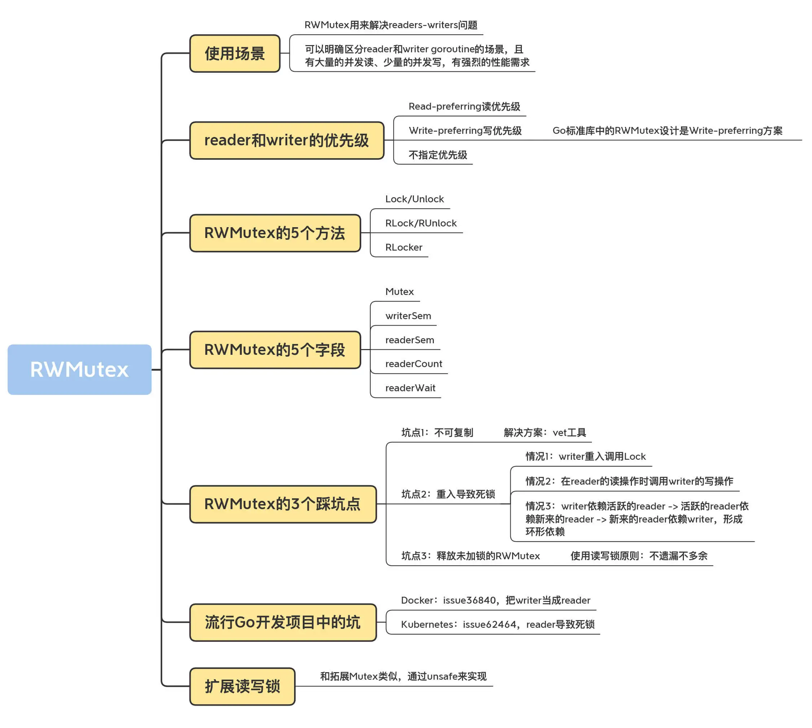

# RWMutex
RWMutex 在某一时刻能由任意数量的 reader 持有，或者是只被单个的 writer 持有。
适合读多写少的场景。

- Lock/Unlock：写操作时调用的方法。如果锁已经被 reader 或者 writer 持有，那么，Lock 方法会一直阻塞，直到能获取到锁；Unlock 则是配对的释放锁的方法。
- RLock/RUnlock：读操作时调用的方法。如果锁已经被 writer 持有的话，RLock 方法会一直阻塞，直到能获取到锁，否则就直接返回；而 RUnlock 是 reader 释放锁的方法。
- RLocker：这个方法的作用是为读操作返回一个 Locker 接口的对象。它的 Lock 方法会调用 RWMutex 的 RLock 方法，它的 Unlock 方法会调用 RWMutex 的 RUnlock 方法。

当一个或者多个 reader 持有锁的时候，竞争锁的 writer 会等待这些 reader 释放完，才可能持有这把锁。
当 writer 请求锁的时候，是无法改变既有的 reader 持有锁的现实的，也不会强制这些 reader 释放锁，它的优先权只是限定后来的 reader 不要和它抢。

<br>

## 实现原理
Go 标准库中的 RWMutex 是基于 Mutex 实现的。

readers-writers 问题一般有三类，基于对读和写操作的优先级，读写锁的设计和实现也分成三类。
- Read-preferring：读优先的设计可以提供很高的并发性，但是，在竞争激烈的情况下可能会导致写饥饿。这是因为，如果有大量的读，这种设计会导致只有所有的读都释放了锁之后，写才可能获取到锁。
- Write-preferring：写优先的设计意味着，如果已经有一个 writer 在等待请求锁的话，它会阻止新来的请求锁的 reader 获取到锁，所以优先保障 writer。当然，如果有一些 reader 已经请求了锁的话，新请求的 writer 也会等待已经存在的 reader 都释放锁之后才能获取。所以，写优先级设计中的优先权是针对新来的请求而言的。这种设计主要避免了 writer 的饥饿问题。
- 不指定优先级：这种设计比较简单，不区分 reader 和 writer 优先级，某些场景下这种不指定优先级的设计反而更有效，因为第一类优先级会导致写饥饿，第二类优先级可能会导致读饥饿，这种不指定优先级的访问不再区分读写，大家都是同一个优先级，解决了饥饿的问题。

Go 标准库中的 RWMutex 设计是 Write-preferring 方案。一个正在阻塞的 Lock 调用会排除新的 reader 请求到锁。
```
type RWMutex struct {
  w           Mutex   // 互斥锁解决多个writer的竞争
  writerSem   uint32  // writer信号量
  readerSem   uint32  // reader信号量
  readerCount int32   // 记录当前 reader 的数量（以及是否有 writer 竞争锁）
  readerWait  int32   // 记录 writer 请求锁时需要等待 read 完成的 reader 的数量
}

const rwmutexMaxReaders = 1 << 30

func (rw *RWMutex) RLock() {
    if atomic.AddInt32(&rw.readerCount, 1) < 0 {
        // rw.readerCount是负值的时候，意味着此时有writer等待请求锁，因为writer优先级高，所以把后来的reader阻塞休眠
        runtime_SemacquireMutex(&rw.readerSem, false, 0)
    }
}
func (rw *RWMutex) RUnlock() {
    if r := atomic.AddInt32(&rw.readerCount, -1); r < 0 {
        rw.rUnlockSlow(r) // 有等待的writer
    }
}
func (rw *RWMutex) rUnlockSlow(r int32) {
    if atomic.AddInt32(&rw.readerWait, -1) == 0 {
        // 最后一个reader了，writer终于有机会获得锁了
        runtime_Semrelease(&rw.writerSem, false, 1)
    }
}


func (rw *RWMutex) Lock() {
    // 首先解决其他writer竞争问题
    rw.w.Lock()
    // 一旦一个 writer 获得了内部的互斥锁，就会反转 readerCount 字段，把它从原来的正整数 readerCount(>=0) 修改为负数（readerCount-rwmutexMaxReaders），让这个字段保持两个含义（既保存了 reader 的数量，又表示当前有 writer）。
    // 比如 readerCount = 2 rwmutexMaxReaders是10，那么这个时候会变成-8 把2变成负数，一样保存了readerCount 然后r = -8+10 = 2
    r := atomic.AddInt32(&rw.readerCount, -rwmutexMaxReaders) + rwmutexMaxReaders
    
    // 如果当前有reader持有锁，那么需要等待
    // 每当一个 reader 释放读锁的时候（调用 RUnlock 方法时），readerWait 字段就减 1，直到所有的活跃的 reader 都释放了读锁，才会唤醒这个 writer。
    if r != 0 && atomic.AddInt32(&rw.readerWait, r) != 0 {
        runtime_SemacquireMutex(&rw.writerSem, false, 0)
    }
}


func (rw *RWMutex) Unlock() {
    // 告诉reader没有活跃的writer了
    r := atomic.AddInt32(&rw.readerCount, rwmutexMaxReaders)
    
    // 唤醒阻塞的reader们
    for i := 0; i < int(r); i++ {
        runtime_Semrelease(&rw.readerSem, false, 0)
    }
    // 释放内部的互斥锁
    rw.w.Unlock()
}
```

<br>

## RWMutex 的 3 个踩坑点
- 坑点 1：不可复制。底层使用Mutex, Mutex不可复制，RWMutex也不可复制。
- 坑点 2：重入导致死锁。使用读写锁最需要注意的一点就是尽量避免重入，重入带来的死锁非常隐蔽，而且难以诊断。
- 坑点 3：释放未加锁的 RWMutex。


## 总结

