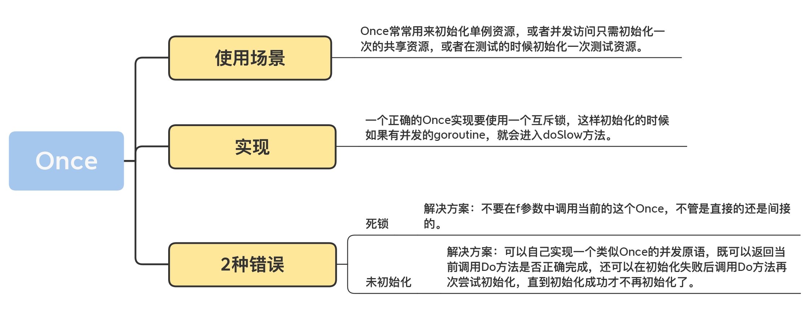

# Once
sync.Once 只暴露了一个方法 Do，你可以多次调用 Do 方法，但是只有第一次调用 Do 方法时 f 参数才会执行，这里的 f 是一个无参数无返回值的函数。
```
func (o *Once) Do(f func())
```
-> [demo](./once_test.go)

<br>

## 案例
标准库内部cache的实现上，就使用了 Once 初始化 Cache 资源
```
  func Default() *Cache { // 获取默认的Cache
    defaultOnce.Do(initDefaultCache) // 初始化cache
    return defaultCache
  }
  
  // 定义一个全局的cache变量，使用Once初始化，所以也定义了一个Once变量
  var (
    defaultOnce  sync.Once
    defaultCache *Cache
  )

  func initDefaultCache() { //初始化cache,也就是Once.Do使用的f函数
    ......
    defaultCache = c
  }

  // 其它一些Once初始化的变量，比如defaultDir
  var (
    defaultDirOnce sync.Once
    defaultDir     string
    defaultDirErr  error
  )
```
除此之外，还有保证只调用一次 copyenv 的 envOnce，strings 包下的 Replacer，time 包中的测试，Go 拉取库时的proxy，
net.pipe，crc64，Regexp，……，数不胜数

<br>

## 如何实现一个 Once？
```
type Once struct {
    done uint32
}

func (o *Once) Do(f func()) {
    if !atomic.CompareAndSwapUint32(&o.done, 0, 1) {
        return
    }
    f()
}
```
这个实现有一个很大的问题，就是如果参数 f 执行很慢的话，后续调用 Do 方法的 goroutine 虽然看到 done 已经设置为执行过了，
但是获取某些初始化资源的时候可能会得到空的资源，因为可能 f 还没有执行完。

一个正确的 Once 实现要使用一个互斥锁，互斥锁的机制保证只有一个 goroutine 进行初始化，
同时利用双检查的机制（double-checking），再次判断 o.done 是否为 0，如果为 0，则是第一次执行，
执行完毕后，就将 o.done 设置为 1，然后释放锁。

即使此时有多个 goroutine 同时进入了 doSlow 方法，因为双检查的机制，后续的 goroutine 会看到 o.done 的值为 1，也不会再次执行 f。
```
type Once struct {
    done uint32
    m    Mutex
}

func (o *Once) Do(f func()) {
    if atomic.LoadUint32(&o.done) == 0 {
        o.doSlow(f)
    }
}

func (o *Once) doSlow(f func()) {
    o.m.Lock()
    defer o.m.Unlock()
    // 双检查
    if o.done == 0 {
        defer atomic.StoreUint32(&o.done, 1)
        f()
    }
}
```

<br>

## 案例
如果 f 方法执行的时候 panic，或者 f 执行初始化资源的时候失败了，这个时候，Once 还是会认为初次执行已经成功了，即使再次调用 Do 方法，也不会再次执行 f。

比如下面的例子，由于一些防火墙的原因，googleConn 并没有被正确的初始化，后面如果想当然认为既然执行了 Do 方法 googleConn 就已经初始化的话，会抛出空指针的错误：
```
func main() {
    var once sync.Once
    var googleConn net.Conn // 到Google网站的一个连接

    once.Do(func() {
        // 建立到google.com的连接，有可能因为网络的原因，googleConn并没有建立成功，此时它的值为nil
        googleConn, _ = net.Dial("tcp", "google.com:80")
    })
    // 发送http请求
    googleConn.Write([]byte("GET / HTTP/1.1\r\nHost: google.com\r\n Accept: */*\r\n\r\n"))
    io.Copy(os.Stdout, googleConn)
}
```
我们可以自己实现一个类似 Once 的并发原语，既可以返回当前调用 Do 方法是否正确完成，还可以在初始化失败后调用 Do 方法再次尝试初始化，直到初始化成功才不再初始化了。
```
// 一个功能更加强大的Once
type Once struct {
    m    sync.Mutex
    done uint32
}
// 传入的函数f有返回值error，如果初始化失败，需要返回失败的error
// Do方法会把这个error返回给调用者
func (o *Once) Do(f func() error) error {
    if atomic.LoadUint32(&o.done) == 1 { //fast path
        return nil
    }
    return o.slowDo(f)
}
// 如果还没有初始化
func (o *Once) slowDo(f func() error) error {
    o.m.Lock()
    defer o.m.Unlock()
    var err error
    if o.done == 0 { // 双检查，还没有初始化
        err = f()
        if err == nil { // 初始化成功才将标记置为已初始化
            atomic.StoreUint32(&o.done, 1)
        }
    }
    return err
}
```

如何检查是否已经初始化了：
```
type AnimalStore struct {once   sync.Once;inited uint32}
func (a *AnimalStore) Init() // 可以被并发调用
  a.once.Do(func() {
    longOperationSetupDbOpenFilesQueuesEtc()
    atomic.StoreUint32(&a.inited, 1)
  })
}
func (a *AnimalStore) CountOfCats() (int, error) { // 另外一个goroutine
  if atomic.LoadUint32(&a.inited) == 0 { // 初始化后才会执行真正的业务逻辑
    return 0, NotYetInitedError
  }
        //Real operation
}
```

<br>

## 总结
Once 并发原语解决的问题和使用场景：Once 常常用来初始化单例资源，或者并发访问只需初始化一次的共享资源，或者在测试的时候初始化一次测试资源。
