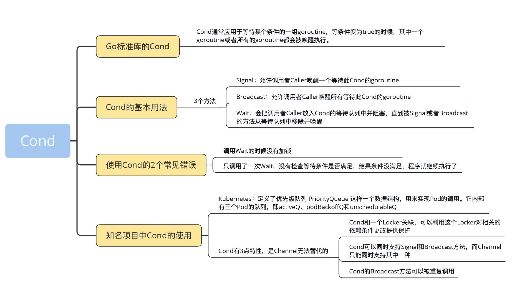

# Cond
Cond 通常应用于等待某个条件的一组 goroutine，等条件变为 true 的时候，其中一个 goroutine 或者所有的 goroutine 都会被唤醒执行。

从开发实践上，我们真正使用 Cond 的场景比较少，因为一旦遇到需要使用 Cond 的场景，我们更多地会使用 Channel 的方式。
因为那才是更地道的 Go 语言的写法，甚至 Go 的开发者有个“把 Cond 从标准库移除”的提议。

## Cond基本用法
```
type Cond
  func NeWCond(l Locker) *Cond
  func (c *Cond) Broadcast()
  func (c *Cond) Signal()
  func (c *Cond) Wait()
```
- Signal 方法，允许调用者 Caller 唤醒一个等待此 Cond 的 goroutine。
如果此时没有等待的 goroutine，显然无需通知 waiter；如果 Cond 等待队列中有一个或者多个等待的 goroutine，则需要从等待队列中移除第一个 goroutine 并把它唤醒。

- Broadcast 方法，允许调用者 Caller 唤醒所有等待此 Cond 的 goroutine。
如果此时没有等待的 goroutine，显然无需通知 waiter；如果 Cond 等待队列中有一个或者多个等待的 goroutine，则清空所有等待的 goroutine，并全部唤醒。

- Wait 方法，会把调用者 Caller 放入 Cond 的等待队列中并阻塞，直到被 Signal 或者 Broadcast 的方法从等待队列中移除并唤醒。
调用 Wait 方法时必须要持有 c.L 的锁。

->[ demo ](./cond_test.go)

Cond 的使用其实没那么简单。它的复杂在于：一，这段代码有时候需要加锁，有时候可以不加；
二，Wait 唤醒后需要检查条件；三，条件变量的更改，其实是需要原子操作或者互斥锁保护的。
所以，有的开发者会认为，Cond 是唯一难以掌握的 Go 并发原语。

## Cond 的实现原理
```
type Cond struct {
    noCopy noCopy

    // 当观察或者修改等待条件的时候需要加锁
    L Locker

    // 等待队列
    notify  notifyList
    checker copyChecker
}

func NewCond(l Locker) *Cond {
    return &Cond{L: l}
}

func (c *Cond) Wait() {
    c.checker.check()
    // 增加到等待队列中
    t := runtime_notifyListAdd(&c.notify)
    c.L.Unlock()
    // 阻塞休眠直到被唤醒
    runtime_notifyListWait(&c.notify, t)
    c.L.Lock()
}

func (c *Cond) Signal() {
    c.checker.check()
    runtime_notifyListNotifyOne(&c.notify)
}

func (c *Cond) Broadcast() {
    c.checker.check()
    runtime_notifyListNotifyAll(&c.notify）
}
```
- runtime_notifyListXXX 是运行时实现的方法，实现了一个等待 / 通知的队列。
- copyChecker 是一个辅助结构，可以在运行时检查 Cond 是否被复制使用。
- Signal 和 Broadcast 只涉及到 notifyList 数据结构，不涉及到锁。
- Wait 把调用者加入到等待队列时会释放锁，在被唤醒之后还会请求锁。在阻塞休眠期间，调用者是不持有锁的，这样能让其他 goroutine 有机会检查或者更新等待变量。

## 两个常见错误
Cond 最常见的使用错误，也就是调用 Wait 的时候没有加锁。如果调用 Wait 之前不加锁的话，就有可能 Unlock 一个未加锁的 Locker。

使用 Cond 的另一个常见错误是，只调用了一次 Wait，没有检查等待条件是否满足，结果条件没满足，程序就继续执行了。
出现这个问题的原因在于，误以为 Cond 的使用，就像 WaitGroup 那样调用一下 Wait 方法等待那么简单。错误示例如下：
```
func main() {
    c := sync.NewCond(&sync.Mutex{})
    var ready int

    for i := 0; i < 10; i++ {
        go func(i int) {
            time.Sleep(time.Duration(rand.Int63n(10)) * time.Second)

            // 加锁更改等待条件
            c.L.Lock()
            ready++
            c.L.Unlock()

            log.Printf("运动员#%d 已准备就绪\n", i)
            // 广播唤醒所有的等待者
            c.Broadcast()
        }(i)
    }

    c.L.Lock()
    // for ready != 10 {
    c.Wait()
    log.Println("裁判员被唤醒一次")
    // }
    c.L.Unlock()

    //所有的运动员是否就绪
    log.Println("所有运动员都准备就绪。比赛开始，3，2，1, ......")
}
```
正确的做法是把97行、100行的注释去掉。

## 总结
