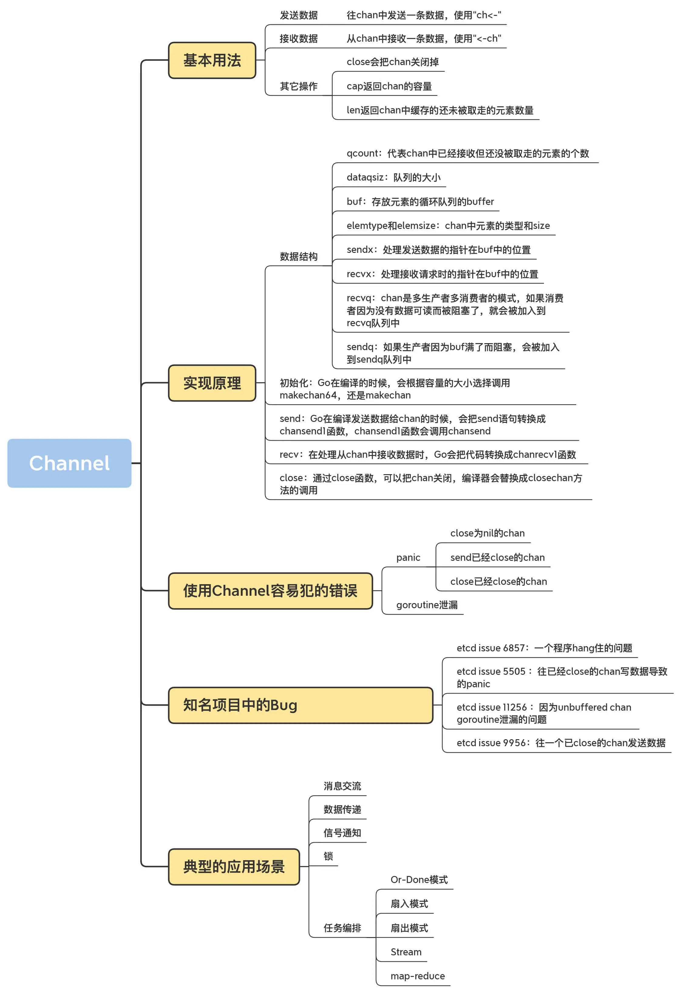

# channel

## channel basic
### (1) 理解channel
Go 程序员中有句格言：不要以共享内存方式通信，要以通信方式共享内存（Don’t communicate by sharing memory, share memory by communicating）
Go中推荐使用channel来进行goroutine之间的通信

你可以简单地把 Go 实现的 CSP 模型类比为生产者 - 消费者模式，而 channel 可以类比为生产者 - 消费者模式中的阻塞队列。
不过，需要注意的是 Go 中 channel 的容量可以是 0，容量为 0 的 channel 在 Go 中被称为无缓冲的 channel，
容量大于 0 的则被称为有缓冲的 channel。

针对 channel ch 的类型不同，len(ch) 有如下两种语义：
- 当 ch 为无缓冲 channel 时，len(ch) 总是返回 0；
- 当 ch 为带缓冲 channel 时，len(ch) 返回当前 channel ch 中尚未被读取的元素个数。
而cap(ch)返回的是信道的容量

channel 原语用于多个 Goroutine 间的通信，一旦多个 Goroutine 共同对 channel 进行收发操作，
len(channel) 就会在多个 Goroutine 间形成“竞态”。
单纯地依靠 len(channel) 来判断 channel 中元素状态，是不能保证在后续对 channel 的收发时 channel 状态是不变的。

但两种场景可以使用：
- 一个是“多发送单接收”的场景，也就是有多个发送者，但有且只有一个接收者。在这样的场景下，
我们可以在接收 goroutine 中使用len(channel)是否大于0来判断是否 channel 中有数据需要接收。
- 另一个是“多接收单发送”的场景，也就是有多个接收者，但有且只有一个发送者。在这样的场景下，
我们可以在发送 Goroutine 中使用len(channel)是否小于cap(channel)来判断是否可以执行向 channel 的发送操作。

### (2) channel的使用
创建一个可以传递bool类型值的无法缓冲channel：var ch = make(chan bool)
发送 : ch<-true 将true写入channel
接收 : v := <-ch 
无缓冲的channel发送操作总是在接收操作之前完成
无缓冲channel必须收发配对，否则信道将阻塞，发生死锁。就像快递一样，快递员<->用户。
无缓冲信道收和发都会发生阻塞。

指定第二个参数则定义有缓冲信道：
```
var ch = make(chan bool, 3) 
```
这样就定义了一个缓存大小为3的channel. 则有cap(ch) = 3

当缓存满的情况下，才会阻塞向channel中发送数据；同样，只有缓存为空时才会阻塞从channel中接收数据
在容量为C的channel上的第k个接收先行发生于从这个channel上的第k+C次发送完成.
（举个例子，容量为3，那么发的第1个包，一定比第4个早发送完成，但不保证第1个包和第2个包谁先谁后）

可以通过带缓冲的channel来实现计数信号量：channel中的元素数量对应着活动的数量，
channel的容量表示同时活动的最大数量，发送元素获取信号量，接收元素释放信号量，这是限制并发的通常用法。
```
var limit = make(chan int, 3)
func main() {
    for _, w := range work {   
         go func(w func()) {
            limit <- 1
            w()
            <-limit
        }(w)
    }
    select{}
}
```
这些goroutine通过有限制的channel来确保最多同时执行三个工作函数（w）, 更建议使用sync.WaitGroup

- 唯送信道： ch := make(chan<-int) 即只能往信道中发送数据
- 唯收信道： ch := make(<-chan int) 即只能从信道中读取数据

tips:<strong>看<-在chan的左边还是右边，在左边就是唯收，右边就是唯送</strong>

意义：函数的入参定义，可以限制唯送或者唯收，但是传入的实际变量可以是双向的

close(ch)关闭一个信道。
```
for x := range ch
```
接收信道数时，遇到信道关闭，接收方仍然可以从信道中取到数据，读取完后会退出循环。
如果信道中没有数据，也没有关闭信道则会阻塞。

向关闭的信道发送数据会导致panic
```
v,ok := <-ch 
```
可以用第二个参数ok判断信道是否已经关闭，ok为false说明信道已经关闭

### nil channel
如果一个 channel 类型变量的值为 nil，我们称它为 nil channel。
nil channel 有一个特性，那就是对 nil channel 的读写都会发生阻塞。
```
func main() {
	var c chan int
	<-c //阻塞
}
```
或者：
```
func main() {
	var c chan int
	c<-1  //阻塞
}
```

<br>

## channel principal
### chan data structure

-> https://github.com/golang/go/blob/master/src/runtime/chan.go#L32

- qcount：代表 chan 中已经接收但还没被取走的元素的个数。内建函数 len 可以返回这个字段的值。
- dataqsiz：队列的大小。chan 使用一个循环队列来存放元素，循环队列很适合这种生产者 - 消费者的场景（我很好奇为什么这个字段省略 size 中的 e）。
- buf：存放元素的循环队列的 buffer。
- elemtype 和 elemsize：chan 中元素的类型和 size。因为 chan 一旦声明，它的元素类型是固定的，即普通类型或者指针类型，所以元素大小也是固定的。
- sendx：处理发送数据的指针在 buf 中的位置。一旦接收了新的数据，指针就会加上 elemsize，移向下一个位置。buf 的总大小是 elemsize 的整数倍，而且 buf 是一个循环列表。
- recvx：处理接收请求时的指针在 buf 中的位置。一旦取出数据，此指针会移动到下一个位置。
- recvq：chan 是多生产者多消费者的模式，如果消费者因为没有数据可读而被阻塞了，就会被加入到 recvq 队列中。
- sendq：如果生产者因为 buf 满了而阻塞，会被加入到 sendq 队列中


### 初始化
我们只关注 makechan 就好了，因为 makechan64 只是做了 size 检查，底层还是调用 makechan 实现的
```
func makechan(t *chantype, size int) *hchan {
    elem := t.elem
  
        // 略去检查代码
        mem, overflow := math.MulUintptr(elem.size, uintptr(size))
        
    //
    var c *hchan
    switch {
    case mem == 0:
      // chan的size或者元素的size是0，不必创建buf
      c = (*hchan)(mallocgc(hchanSize, nil, true))
      c.buf = c.raceaddr()
    case elem.ptrdata == 0:
      // 元素不是指针，分配一块连续的内存给hchan数据结构和buf
      c = (*hchan)(mallocgc(hchanSize+mem, nil, true))
            // hchan数据结构后面紧接着就是buf
      c.buf = add(unsafe.Pointer(c), hchanSize)
    default:
      // 元素包含指针，那么单独分配buf
      c = new(hchan)
      c.buf = mallocgc(mem, elem, true)
    }
  
        // 元素大小、类型、容量都记录下来
    c.elemsize = uint16(elem.size)
    c.elemtype = elem
    c.dataqsiz = uint(size)
    lockInit(&c.lock, lockRankHchan)

    return c
}
```
### 往channel发送数据
Go 在编译发送数据给 chan 的时候，会把 send 语句转换成 chansend1 函数，chansend1 函数会调用 chansend
```
func chansend1(c *hchan, elem unsafe.Pointer) {
    chansend(c, elem, true, getcallerpc())
}
func chansend(c *hchan, ep unsafe.Pointer, block bool, callerpc uintptr) bool {
        // 第一部分
    if c == nil {
      if !block {
        return false
      }
      // 如果 chan 是 nil 的话，就把调用者 goroutine park（阻塞休眠）， 调用者就永远被阻塞住了
      gopark(nil, nil, waitReasonChanSendNilChan, traceEvGoStop, 2)
      throw("unreachable")
    }
    ......

    // 第二部分，如果chan没有被close,并且chan满了，直接返回
    // chansend1 方法在调用 chansend 的时候设置了阻塞参数，所以不会执行到第二部分的分支里。
        if !block && c.closed == 0 && full(c) {
        return false
    }
    ......


  // 第三部分，chan已经被close的情景
    lock(&c.lock) // 开始加锁
    if c.closed != 0 {
        unlock(&c.lock)
        // 如果 chan 已经被 close 了，再往里面发送数据的话会 panic。
        panic(plainError("send on closed channel"))
    }

    ......
    // 第四部分，从接收队列中出队一个等待的receiver
    // 如果等待队列中有等待的 receiver，那么这段代码就把它从队列中弹出，然后直接把数据交给它（通过 memmove(dst, src, t.size)），而不需要放入到 buf 中，速度可以更快一些。
    if sg := c.recvq.dequeue(); sg != nil {
        send(c, sg, ep, func() { unlock(&c.lock) }, 3)
        return true
    }
    ......


    // 第五部分，buf还没满, 当前没有 receiver，需要把数据放入到 buf 中，放入之后，就成功返回了
    if c.qcount < c.dataqsiz {
        qp := chanbuf(c, c.sendx)
        if raceenabled {
            raceacquire(qp)
            racerelease(qp)
        }
        typedmemmove(c.elemtype, qp, ep)
        c.sendx++
        if c.sendx == c.dataqsiz {
            c.sendx = 0
        }
        c.qcount++
        unlock(&c.lock)
        return true
    }
    ......
    
    // 第六部分，buf满。
    // chansend1不会进入if块里，因为chansend1的block=true
    // 第六部分是处理 buf 满的情况。如果 buf 满了，发送者的 goroutine 就会加入到发送者的等待队列中，直到被唤醒。这个时候，数据或者被取走了，或者 chan 被 close 了。
    if !block {
      unlock(&c.lock)
      return false
    }
    ......
}
```

### 接收数据
在处理从 chan 中接收数据时，Go 会把代码转换成 chanrecv1 函数，如果要返回两个返回值，会转换成 chanrecv2，chanrecv1 函数和 chanrecv2 会调用 chanrecv:
```
func chanrecv1(c *hchan, elem unsafe.Pointer) {
    // chanrecv1 和 chanrecv2 传入的 block 参数的值是 true，都是阻塞方式，所以我们分析 chanrecv 的实现的时候，不考虑 block=false 的情况。
    chanrecv(c, elem, true)
}
func chanrecv2(c *hchan, elem unsafe.Pointer) (received bool) {
    _, received = chanrecv(c, elem, true)
    return
}

func chanrecv(c *hchan, ep unsafe.Pointer, block bool) (selected, received bool) {
        // 第一部分，chan为nil
    if c == nil {
        if !block {
            return
        }
        // chan 为 nil 的情况。和 send 一样，从 nil chan 中接收（读取、获取）数据时，调用者会被永远阻塞
        gopark(nil, nil, waitReasonChanReceiveNilChan, traceEvGoStop, 2)
        throw("unreachable")
    }
    ......


    // 加锁，返回时释放锁
    lock(&c.lock)
    // 如果 chan 已经被 close 了，并且队列中没有缓存的元素，那么返回 true、false
    if c.closed != 0 && c.qcount == 0 {
        unlock(&c.lock)
        if ep != nil {
            typedmemclr(c.elemtype, ep)
        }
        return true, false
    }

    .......

    // 如果sendq队列中有等待发送的sender
    if sg := c.sendq.dequeue(); sg != nil {
        recv(c, sg, ep, func() { unlock(&c.lock) }, 3)
        return true, true
    }
    ......


    // 处理没有等待的 sender 的情况。这个是和 chansend 共用一把大锁，所以不会有并发的问题。如果 buf 有元素，就取出一个元素给 receiver。
    if c.qcount > 0 {
      qp := chanbuf(c, c.recvx)
      if ep != nil {
        typedmemmove(c.elemtype, ep, qp)
      }
      typedmemclr(c.elemtype, qp)
      c.recvx++
      if c.recvx == c.dataqsiz {
        c.recvx = 0
      }
      c.qcount--
      unlock(&c.lock)
      return true, true
    }

    if !block {
      unlock(&c.lock)
      return false, false
    }

    ......
     // buf中没有元素，阻塞
}
```

### close
如果 chan 为 nil，close 会 panic；如果 chan 已经 closed，再次 close 也会 panic。
否则的话，如果 chan 不为 nil，chan 也没有 closed，就把等待队列中的 sender（writer）和 receiver（reader）从队列中全部移除并唤醒。
```
func closechan(c *hchan) {
    if c == nil { // chan为nil, panic
      panic(plainError("close of nil channel"))
    }
  
    lock(&c.lock)
    if c.closed != 0 {// chan已经closed, panic
      unlock(&c.lock)
      panic(plainError("close of closed channel"))
    }

    c.closed = 1  

    var glist gList

    // 释放所有的reader
    for {
      sg := c.recvq.dequeue()
      ......
      gp := sg.g
      ......
      glist.push(gp)
    }
  
    // 释放所有的writer (它们会panic)
    for {
      sg := c.sendq.dequeue()
      ......
      gp := sg.g
      ......
      glist.push(gp)
    }
    unlock(&c.lock)
  
    for !glist.empty() {
      gp := glist.pop()
      gp.schedlink = 0
      goready(gp, 3)
    }
}
```

<br>

## summary
