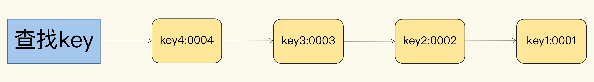
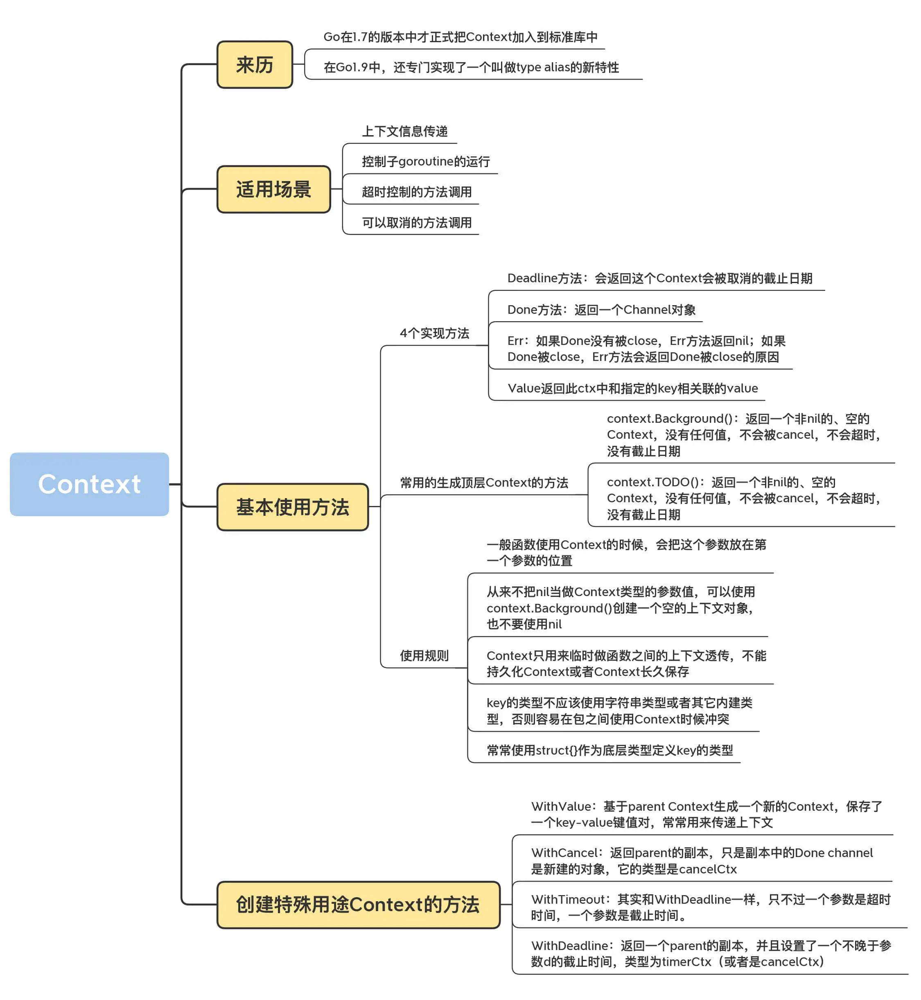

# Context
Go 在 1.7 的版本中才正式把 Context 加入到标准库中。

1. Context的使用场景

在很多场景下，使用 Context 其实会很方便，所以现在它已经在 Go 生态圈中传播开来了，包括很多的 Web 应用框架，都切换成了标准库的 Context。
标准库中的 database/sql、os/exec、net、net/http 等包中都使用到了 Context。

如果我们遇到了下面的一些场景，也可以考虑使用 Context：
- 上下文信息传递 （request-scoped），比如处理 http 请求、在请求处理链路上传递信息；
- 控制子 goroutine 的运行；
- 超时控制的方法调用；
- 可以取消的方法调用。

2. Context接口
```
type Context interface {
	Deadline() (deadline time.Time, ok bool)

	Done() <-chan struct{}

	Err() error

	Value(key interface{}) interface{}
}
```
Deadline 方法是获取设置的截止时间的意思，第一个返回式是截止时间，到了这个时间点，Context 会自动发起取消请求；
第二个返回值 ok==false 时表示没有设置截止时间，如果需要取消的话，需要调用取消函数进行取消。

Done 方法返回一个只读的 chan，类型为 struct{}。
你必须要记住的知识点就是：如果 Done 没有被 close，Err 方法返回 nil；如果 Done 被 close，Err 方法会返回 Done 被 close 的原因（ cancel、timeout、deadline 都可能导致 Done 被 close）。
我们通过 Done 方法收到这个信号后，就应该做清理操作，然后退出 goroutine，释放资源。

Err 方法返回取消的错误原因，为什么 Context 被取消。

Value 方法获取该 Context 上绑定的值，是一个键值对，所以要通过一个 Key 才可以获取对应的值，这个值一般是线程安全的。

3. 经典用法
```
func Stream(ctx context.Context, out chan<- Value) error {
    for {
        v, err := DoSomething(ctx)
        if err != nil {
            return err
        }
        select {
        case <-ctx.Done():
            return ctx.Err()
        case out <- v:
        }
    }
}
```
直到 Context 被取消（cancel()）的时候，我们就可以得到一个关闭的 chan，关闭的 chan 是可以读取的，
所以只要可以读取的时候（<-ctx.Done()），就意味着收到 Context 取消的信号了。

4. Context接口实现
Context 接口并不需要我们实现，Go 内置已经帮我们实现了 2 个，
我们代码中最开始都是以这两个内置的作为最顶层的 partent context，衍生出更多的子 Context。
```
var (
	background = new(emptyCtx)
	todo       = new(emptyCtx)
)

func Background() Context {
	return background
}

func TODO() Context {
	return todo
}
```
一个是 Background，主要用于 main 函数、初始化以及测试代码中，作为 Context 这个树结构的最顶层的 Context，也就是根 Context。

一个是 TODO，它目前还不知道具体的使用场景，如果我们不知道该使用什么 Context 的时候，可以使用这个。

事实上，它们两个底层的实现是一模一样的。 它们两个本质上都是 emptyCtx 结构体类型，是一个不可取消，没有设置截止时间，没有携带任何值的 Context。

```
type emptyCtx int

func (*emptyCtx) Deadline() (deadline time.Time, ok bool) {
	return
}

func (*emptyCtx) Done() <-chan struct{} {
	return nil
}

func (*emptyCtx) Err() error {
	return nil
}

func (*emptyCtx) Value(key interface{}) interface{} {
	return nil
}
```
这就是 emptyCtx 实现 Context 接口的方法，可以看到，这些方法什么都没做，返回的都是 nil 或者零值。


5. Context 的继承衍生

有了如上的根 Context，那么是如何衍生更多的子 Context 的呢？这就要靠 context 包为我们提供的 With 系列的函数了。
```
func WithCancel(parent Context) (ctx Context, cancel CancelFunc)
func WithDeadline(parent Context, deadline time.Time) (Context, CancelFunc)
func WithTimeout(parent Context, timeout time.Duration) (Context, CancelFunc)
func WithValue(parent Context, key, val interface{}) Context
```
这四个 With 函数，接收的都有一个 partent 参数，就是父 Context，
我们要基于这个父 Context 创建出子 Context 的意思，这种方式可以理解为子 Context 对父 Context 的继承，
也可以理解为基于父 Context 的衍生。

通过这些函数，就创建了一颗 Context 树，树的每个节点都可以有任意多个子节点，节点层级可以有任意多个。
- WithCancel 函数，传递一个父 Context 作为参数，返回子 Context，以及一个取消函数用来取消 Context。 
- WithDeadline 函数，和 WithCancel 差不多，它会多传递一个截止时间参数，意味着到了这个时间点，会自动取消 Context，当然我们也可以不等到这个时候，可以提前通过取消函数进行取消。
- WithTimeout 和 WithDeadline 基本上一样，这个表示是超时自动取消，是多少时间后自动取消 Context 的意思。
- WithValue 函数和取消 Context 无关，它是为了生成一个绑定了一个键值对数据的 Context，
这个绑定的数据可以通过 Context.Value 方法访问到。

大家可能留意到，前三个函数都返回一个取消函数 CancelFunc，这是一个函数类型，它的定义非常简单。
```
type CancelFunc func()
```
这就是取消函数的类型，该函数可以取消一个 Context，以及这个节点 Context下所有的所有的 Context，不管有多少层级。

## WithValue
WithValue 方法其实是创建了一个类型为 valueCtx 的 Context：
```
type valueCtx struct {
    Context
    key, val interface{}
}
```
它持有一个 key-value 键值对，还持有 parent 的 Context。它覆盖了 Value 方法，优先从自己的存储中检查这个 key，不存在的话会从 parent 中继续检查。
这样实际形成了一个链式结构：



```
ctx = context.TODO()
ctx = context.WithValue(ctx, "key1", "0001")
ctx = context.WithValue(ctx, "key2", "0001")
ctx = context.WithValue(ctx, "key3", "0001")
ctx = context.WithValue(ctx, "key4", "0004")

fmt.Println(ctx.Value("key1"))
```

<br>

## WithCancel
不是只有你想中途放弃，才去调用 cancel，只要你的任务正常完成了，就需要调用 cancel，
这样，这个 Context 才能释放它的资源（通知它的 children 处理 cancel，从它的 parent 中把自己移除，甚至释放相关的 goroutine）。
很多同学在使用这个方法的时候，都会忘记调用 cancel，切记切记，而且一定尽早释放。
```
func WithCancel(parent Context) (ctx Context, cancel CancelFunc) {
    c := newCancelCtx(parent)
    propagateCancel(parent, &c)// 把c朝上传播
    return &c, func() { c.cancel(true, Canceled) }
}

// newCancelCtx returns an initialized cancelCtx.
func newCancelCtx(parent Context) cancelCtx {
    return cancelCtx{Context: parent}
}
```
propagateCancel 方法会顺着 parent 路径往上找，直到找到一个 cancelCtx，或者为 nil。
如果不为空，就把自己加入到这个 cancelCtx 的 child，以便这个 cancelCtx 被取消的时候通知自己。
如果为空，会新起一个 goroutine，由它来监听 parent 的 Done 是否已关闭。

cancel 是向下传递的，如果一个 WithCancel 生成的 Context 被 cancel 时，如果它的子 Context（也有可能是孙，或者更低，依赖子的类型）也是 cancelCtx 类型的，就会被 cancel，但是不会向上传递。
parent Context 不会因为子 Context 被 cancel 而 cancel。

6. Context 使用原则
- 不要把 Context 放在结构体中，要以参数的方式传递
- 以 Context 作为参数的函数方法，应该把 Context 作为第一个参数，放在第一位。
- 给一个函数方法传递 Context 的时候，不要传递 nil，如果不知道传递什么，就使用 context.TODO
- Context 的 Value 相关方法应该传递必须的数据，不要什么数据都使用这个传递
- Context 是线程安全的，可以放心的在多个 goroutine 中传递
- key 的类型尽量不实用字符串类型或者其它内建类型，否则容易在包之间使用 Context 时候产生冲突。使用 WithValue 时，key 的类型应该是自己定义的类型。

<br>

## 总结



<br>

## 拓展资料
- https://dave.cheney.net/2017/08/20/context-isnt-for-cancellation