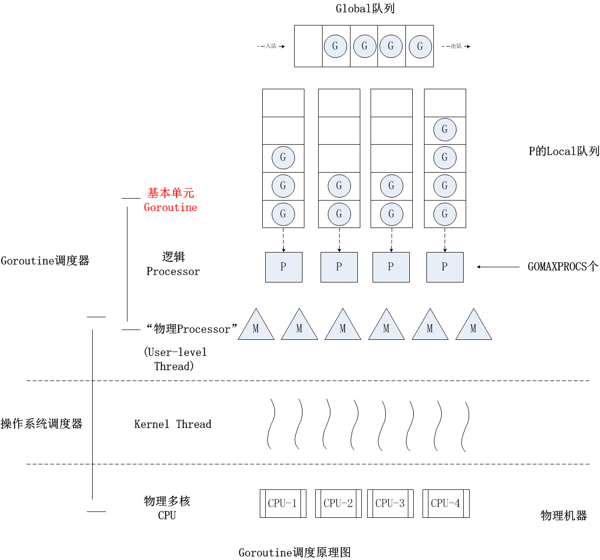

# Goroutinue
## 1. Goroutine的调度
Goroutine 占用的资源非常小，每个 Goroutine 栈的大小默认是 2KB。
而且，Goroutine 调度的切换也不用陷入（trap）操作系统内核层完成，代价很低。

一个 Go 程序中可以创建成千上万个并发的 Goroutine。而将这些 Goroutine 按照一定算法放到“CPU”上执行的程序，
就被称为 Goroutine 调度器（Goroutine Scheduler），注意，这里说的“CPU”打了引号。

一个 Go 程序对于操作系统来说只是一个用户层程序，操作系统眼中只有线程，它甚至不知道有一种叫 Goroutine 的事物存在。
所以，Goroutine 的调度全要靠 Go 自己完成。那么，实现 Go 程序内 Goroutine 之间“公平”竞争“CPU”资源的任务，
就落到了 Go 运行时（runtime）头上了。

在操作系统层面，线程竞争的“CPU”资源是真实的物理 CPU，
但在 Go 程序层面，各个 Goroutine 要竞争的“CPU”资源又是什么呢？
Go 程序是用户层程序，它本身就是整体运行在一个或多个操作系统线程上的。
所以这个答案就出来了：Goroutine 们要竞争的“CPU”资源就是操作系统线程。
这样，Goroutine 调度器的任务也就明确了：将 Goroutine 按照一定算法放到不同的操作系统线程中去执行。

## 2. Goroutine调度模型
Goroutine使用GMP模型



G:  代表 Goroutine，存储了 Goroutine 的执行栈信息、Goroutine 状态以及 Goroutine 的任务函数等，
而且 G 对象是可以重用的；

P:  代表逻辑 processor，P 的数量决定了系统内最大可并行的 G 的数量，
P 的最大作用还是其拥有的各种 G 对象队列、链表、一些缓存和状态；

M:  M 代表着真正的执行计算资源。在绑定有效的 P 后，进入一个调度循环，
而调度循环的机制大致是从 P 的本地运行队列以及全局队列中获取 G，切换到 G 的执行栈上并执行 G 的函数，
调用 goexit 做清理工作并回到 M，如此反复。M 并不保留 G 状态，这是 G 可以跨 M 调度的基础。

总结一下：
P 是一个“逻辑 Proccessor”，每个 G（Goroutine）要想真正运行起来，首先需要被分配一个 P，
也就是进入到 P 的本地运行队列（local runq）中。对于 G 来说，P 就是运行它的“CPU”，
可以说：在 G 的眼里只有 P。
但从 Go 调度器的视角来看，真正的“CPU”是 M，只有将 P 和 M 绑定，才能让 P 的 runq 中的 G 真正运行起来。

## 3. 演进

G-P-M 模型的实现算是Go调度器的一大进步，但调度器仍然有一个令人头疼的问题，那就是不支持抢占式调度，
这导致一旦某个 G 中出现死循环的代码逻辑，那么 G 将永久占用分配给它的 P 和 M，
而位于同一个 P 中的其他 G 将得不到调度，出现“饿死”的情况。

Go 1.2 中实现了基于协作的“抢占式”调度。
这个抢占式调度的原理就是，Go 编译器在每个函数或方法的入口处加上了一段额外的代码 (runtime.morestack_noctxt)，
让运行时有机会在这段代码中检查是否需要执行抢占调度。

这种解决方案只能说局部解决了“饿死”问题，只在有函数调用的地方才能插入“抢占”代码（埋点），
对于没有函数调用而是纯算法循环计算的 G，Go 调度器依然无法抢占。
比如，死循环等并没有给编译器插入抢占代码的机会，这就会导致 GC 在等待所有 Goroutine 停止时的等待时间过长，
从而导致 GC 延迟，内存占用瞬间冲高；甚至在一些特殊情况下，导致在 STW（stop the world）时死锁。


为了解决这些问题，Go 在 1.14 版本中接受了奥斯汀 - 克莱门茨（Austin Clements）的提案，
增加了对非协作的抢占式调度的支持，这种抢占式调度是基于系统信号的，也就是通过向线程发送信号的方式来抢占正在运行的 Goroutine。

除了这些大的迭代外，Goroutine 的调度器还有一些小的优化改动，比如通过文件 I/O poller 减少 M 的阻塞等。
Go 运行时已经实现了 netpoller，这使得即便 G 发起网络 I/O 操作，也不会导致 M 被阻塞（仅阻塞 G），
也就不会导致大量线程（M）被创建出来。


对于文件 I/O 操作来说，一旦阻塞，那么线程（M）将进入挂起状态，等待 I/O 返回后被唤醒。
这种情况下 P 将与挂起的 M 分离，再选择一个处于空闲状态（idle）的 M。
如果此时没有空闲的 M，就会新创建一个 M（线程）。
这种情况下，大量 I/O 操作仍然会导致大量线程被创建。

为此，Go 开发团队的伊恩 - 兰斯 - 泰勒（Ian Lance Taylor）在 Go 1.9 中增加了一个针对文件 I/O 的 Poller的功能，
这个功能可以像 netpoller 那样，在 G 操作那些支持监听（pollable）的文件描述符时，
仅会阻塞 G，而不会阻塞 M。不过这个功能依然不能对常规文件有效，常规文件是不支持监听的（pollable）。
但对于 Go 调度器而言，这也算是一个不小的进步了


## 问题
1）在一个拥有多核处理器的主机上，使用 Go 1.13.x 版本运行这个示例代码，你在命令行终端上是否能看到“I got scheduled!”输出呢？
也就是 main goroutine 在创建 deadloop goroutine 之后是否能继续得到调度呢？

2）我们通过什么方法可以让上面示例中的 main goroutine，在创建 deadloop goroutine 之后无法继续得到调度？
```
func deadloop() {
    for {
    } 
}

func main() {
    go deadloop()
    for {
        time.Sleep(time.Second * 1)
        fmt.Println("I got scheduled!")
    }
}
```
go1.13的话加上runtime.GOMAXPROCS(1) （即只设置1个P），
main goroutine在创建 deadloop goroutine 之后就无法继续得到调度。

但如果是go1.14之后的话即使加上runtime.GOMAXPROCS(1) main goroutine在创建 deadloop goroutine 之后
还是可以得到调度，应该是因为增加了对非协作的抢占式调度的支持。

## 参考资料
https://time.geekbang.org/column/article/476643