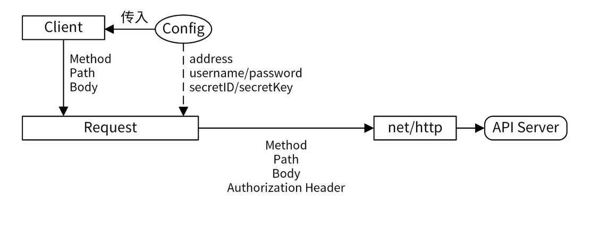

# Go SDK 设计

## 1. 什么是SDK
SDK（Software Development Kit，软件开发工具包），不同场景下有不同的解释。但是对于一个 Go 后端服务来说，SDK 通常是指封装了 Go 后端服务 API 接口的软件包，里面通常包含了跟软件相关的库、文档、使用示例、封装好的 API 接口和工具。

调用 SDK 跟调用本地函数没有太大的区别，所以可以极大地提升开发者的开发效率和体验。SDK 可以由服务提供者提供，也可以由其他组织或个人提供。为了鼓励开发者使用其系统或语言，SDK 通常都是免费提供的。

## 2. SDK 设计方法

### 1）如何给 SDK 命名？
SDK 的名字目前没有统一的规范，但比较常见的命名方式是 
xxx-sdk-go / xxx-sdk-python / xxx-sdk-java ,
其中， xxx 可以是项目名或者组织名。

### 2）SDK 的目录结构
README.md：SDK 的帮助文档，里面包含了安装、配置和使用 SDK 的方法。

examples/sample/：SDK 的使用示例。

sdk/：SDK 共享的包，里面封装了最基础的通信功能。如果是 HTTP 服务，基本都是基于 net/http 包进行封装。

api：如果 xxx-sdk-go 只是为某一个服务提供 SDK，就可以把该服务的所有 API 接口封装代码存放在 api 目录下。

services/{iam, tms} ：如果 xxx-sdk-go 中， xxx 是一个组织，那么这个 SDK 很可能会集成该组织中很多服务的 API，就可以把某类服务的 API 接口封装代码存放在 services/<服务名>下


例如：
```
├── examples            # 示例代码存放目录
│   └── authz.go
├── README.md           # SDK使用文档
├── sdk                 # 公共包，封装了SDK配置、API请求、认证等代码
│   ├── client.go
│   ├── config.go
│   ├── credential.go
│   └── ...
└── services            # API封装
    ├── common
    │   └── model
    ├── iam             # iam服务的API接口
    │   ├── authz.go
    │   ├── client.go
    │   └── ...
    └── tms             # tms服务的API接口
```

### 3）设计方法


通过 Config 配置创建客户端 Client，例如 func NewClient(config sdk.Config) (Client, error)，配置中可以指定下面的信息：

- 服务的后端地址：服务的后端地址可以通过配置文件来配置，也可以直接固化在 SDK 中，推荐后端服务地址可通过配置文件配置。
- 认证信息：最常用的认证方式是通过密钥认证，也有一些是通过用户名和密码认证。
- 其他配置：例如超时时间、重试次数、缓存时间等。

创建的 Client 是一个结构体或者 Go interface。这里我建议你使用 interface 类型，这样可以将定义和具体实现解耦。

在 requset 中可以指定 HTTP 请求的方法 Method、路径 Path 和请求 Body。具体函数中，会调用 c.client.Send(request) 执行具体的 HTTP 请求, 最后将返回结果 Unmarshal 到传入的 resp 结构体中。